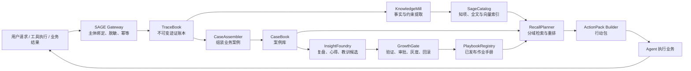
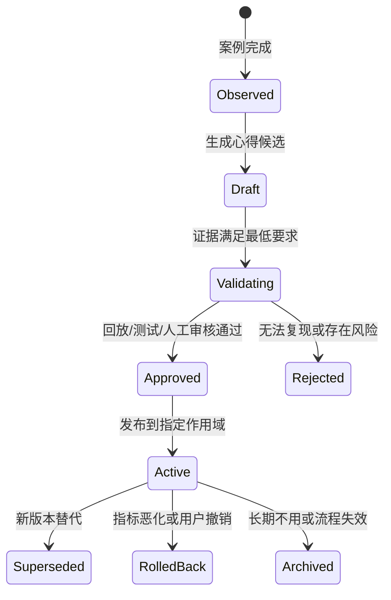

# SAGE 多租户企业经验与成长引擎设计方案

> 状态：Proposed  
> 日期：2026-07-12  
> 适用场景：中小企业私有化部署、多用户 Agent、业务经验长期沉淀与复用  
> 依据：《多租户改造计划》中的账号、Agent 归属、资源授权、共享复制和向后兼容约束

## 1. 设计结论

新系统命名为 **SAGE（Scoped Adaptive Growth Engine，分域自适应成长引擎）**。SAGE 不是对 Minions 旧记忆模块的封装或升级，而是一套从协议、数据模型、存储、生命周期、接口到界面术语都重新设计的企业经验系统。

SAGE 的核心目标不是“保存更多聊天记录”，而是把企业实际完成的业务逐步转化为：

1. 可追溯的业务证据；
2. 可复盘的业务案例；
3. 经过验证的心得与教训；
4. 可直接复用的标准作业手册；
5. 能根据新场景快速装配的 Agent 行动上下文。

系统采用模块化单体和 PostgreSQL 单库架构，使用 pgvector、PostgreSQL 全文检索和数据库任务表完成语义搜索与异步处理。中小企业生产环境不需要额外维护 Kafka、Elasticsearch、Neo4j、Redis 或独立向量数据库。原始附件保存在本地内容寻址仓库，也可替换为 S3 兼容对象存储。

### 1.1 明确不复用的旧概念

以下旧模块、文件、接口和术语均不进入 SAGE 运行时：

- `BaseMemoryManager`、`MemoryMiddleware`、`memory_search`；
- ReMeLight、ADBPG 及其配置；
- Scroll、`history.db`、`recall_history`；
- `MEMORY.md`、`memory/`、`digest/`；
- `summarize`、`dream`、`auto_memory`；
- 原有 memory backend 注册表和目录命名。

旧数据只能由一次性工具 `sage-import` 读取并转化为新 Schema。导入完成后，SAGE 不依赖旧文件或旧代码。

## 2. 方案比较

| 方案 | 优点 | 问题 | 结论 |
|---|---|---|---|
| 每个 Agent 独立文件库 | 部署简单、天然物理隔离 | 跨 Agent 经验复用、审计、冲突、检索和备份困难 | 不采用 |
| PostgreSQL + pgvector 模块化单体 | 一个核心数据库、事务可靠、搜索够用、运维成熟 | 需要部署 PostgreSQL | **推荐** |
| Kafka + 搜索集群 + 图数据库微服务 | 扩展能力强 | 成本、故障面和运维复杂度不适合中小企业 | 暂不采用 |

生产多用户模式以 PostgreSQL 为唯一事实源。单人开发和自动化测试可使用 SQLite 兼容适配器，但 SQLite 模式不作为企业生产部署建议。

## 3. 关键术语与全新命名

| 用户概念 | SAGE 名称 | 代码名称 | 含义 |
|---|---|---|---|
| 一次原始行为 | 迹证 | `Trace` | 对话、工具执行、文件变化、反馈等不可变证据 |
| 一次完整业务 | 案例 | `Case` | 有目标、过程、结果和验收的一次业务经历 |
| 一条事实或约束 | 知项 | `KnowledgeItem` | 可查询、可验证、带有效期的业务知识 |
| 心得或教训候选 | 洞见候选 | `InsightDraft` | 从案例中归纳但尚未生效的经验 |
| 已验证的心得 | 洞见 | `Insight` | 有证据、有适用条件、有可信度的经验 |
| 可重复工作方法 | 作业手册 | `Playbook` | 可版本化、可执行、可回滚的标准流程 |
| 检索结果包 | 行动包 | `ActionPack` | 为当前 Agent 请求组装的最小必要上下文 |
| 自动成长流程 | 成长环 | `GrowthCycle` | 观察、归纳、验证、发布、评估、回滚 |
| 权限上下文 | 执行主体 | `Principal` | 企业、用户、角色、Agent、项目和授权信息 |
| 数据访问策略 | 分域策略 | `ScopePolicy` | 决定数据归属、可见性、保留和发布规则 |

建议代码根目录为：

```text
src/minions/sage/
├── gateway/       # SAGE Gateway：运行时接入
├── tracebook/     # TraceBook：迹证账本
├── casebook/      # CaseBook：业务案例
├── catalog/       # SageCatalog：知项与索引
├── foundry/       # InsightFoundry：经验归纳
├── playbooks/     # PlaybookRegistry：作业手册
├── recall/        # RecallPlanner：检索与行动包
├── policy/        # ScopePolicy：隔离、授权、保留
├── jobs/          # GrowthCycle：异步成长任务
├── storage/       # PostgreSQL、对象仓库适配
├── api/           # 管理与用户 API
└── importers/     # 一次性旧数据导入器
```

## 4. 多租户身份模型修正

《多租户改造计划》当前主要描述的是“一个企业中的多个用户”。SAGE 从第一天保留真正的企业租户字段：

```text
tenant_id     企业，不可为空
user_id       用户不可变 UUID
username      可修改的显示/登录名
agent_uid     Agent 不可变 UUID
agent_slug    可读名称，例如 alice_coder
team_id       可选部门/团队
project_id    可选项目或客户项目
case_id       一次业务案例
session_id    一次交互会话
```

`username` 和 `{username}_{agentname}` 只用于展示与路由，不得作为迹证、案例、知项和作业手册的数据库外键。用户名变更不能导致历史断链。

### 4.1 作用域层级

```text
平台默认
  └── 企业 tenant
       ├── 团队 team
       ├── 用户 user
       │    └── Agent
       │         └── 会话 session
       └── 项目 project
            └── 案例 case
```

作用域越具体优先级越高。项目规则可以覆盖企业默认规则，但不能绕过企业安全与合规规则。

### 4.2 授权模型分离

原计划中的 `Entitlement` 管理“用户能使用哪些 Skill/MCP/Tool”。SAGE 另设数据权限，二者不能混用：

- `ResourceEntitlement`：能否调用某项能力；
- `SageGrant`：能否读取、引用、发布、纠正或删除某类企业经验；
- `ScopePolicy`：数据敏感等级、保留期限、共享边界和审批要求。

一个用户有权使用合同分析工具，不代表他可以检索其他部门的合同案例。

## 5. 总体架构



### 5.1 组件职责

**SAGE Gateway**

- 接收 Agent 生命周期事件，不依赖旧中间件；
- 从请求上下文构建 `Principal`；
- 执行租户、用户、Agent、项目绑定；
- 检测凭据、支付信息和敏感数据；
- 为事件生成 ULID、内容哈希和 trace ID。

**TraceBook**

- 保存不可变迹证；
- 支持幂等追加、撤销标记和合规擦除；
- 是 SAGE 唯一事实源。

**CaseBook**

- 把多轮对话、工具调用和业务结果归为一次完整案例；
- 保存目标、约束、执行步骤、关键决策、交付物、验收与结果。

**InsightFoundry**

- 从完成案例和失败案例中提取心得、例外与风险；
- 只能生成 `InsightDraft`，不得直接改变 Agent 行为。

**GrowthGate**

- 累积证据、运行回放、请求审批、灰度发布和回滚；
- 保证“自我成长”是受控的软件发布流程。

**RecallPlanner**

- 根据业务场景检索案例、知项、洞见和作业手册；
- 权限过滤先于向量查询和排序；
- 输出最小必要的 `ActionPack`。

## 6. 企业业务知识分层

| 层级 | 保存内容 | 默认作用域 | 是否直接影响行动 |
|---|---|---|---|
| 迹证层 | 原始对话、工具参数、结果、文件哈希、反馈 | 用户/Agent/项目 | 否 |
| 案例层 | 一次业务的目标、过程、决策、产出和结果 | 项目/用户/团队 | 仅供参考 |
| 知项层 | 稳定事实、业务规则、客户要求、有效期 | 项目/团队/企业 | 是，需可信度 |
| 洞见层 | 心得、教训、适用条件、反例 | 用户/团队/企业 | 仅 Active 可用 |
| 作业层 | 已验证步骤、检查表、异常处理和验收标准 | 团队/企业 | 是，版本化 |
| 偏好层 | 用户或项目明确表达的输出和协作偏好 | 用户/项目 | 是，可撤销 |

“所有内容都保存”和“所有内容都能被 Agent 使用”必须分开。迹证可以完整，但只有经过权限、有效性和质量检查的内容才能进入行动包。

## 7. 数据模型

### 7.1 `sage_trace`

```text
trace_id              ULID，主键
tenant_id             企业 UUID
user_id               数据主体 UUID
agent_uid              Agent UUID
team_id/project_id     可选业务域
case_id/session_id     案例与会话
trace_type             user_input/agent_output/tool_call/tool_result/file_change/feedback/outcome
payload_json           结构化小载荷
blob_ref               大文本、文件或二进制引用
content_hash           幂等与完整性
classification         public/internal/confidential/restricted
retention_code         保留策略
occurred_at/ingested_at 时间
status                 active/redacted/erased
```

### 7.2 `sage_case`

```text
case_id                UUID
tenant_id              企业
owner_user_id          案例所有者
agent_uid              执行 Agent
domain/process/task    业务域、流程、任务类型
scenario_fingerprint   场景特征 JSONB
goal/constraints       目标与约束
plan_snapshot          执行计划
decision_summary       关键决策
deliverable_refs       交付物引用
outcome                success/partial/failure/cancelled
outcome_metrics        时间、成本、质量、业务 KPI
review_status          pending/accepted/rejected
started_at/completed_at 时间
```

### 7.3 `sage_item`

统一保存知项、偏好、洞见和负面经验：

```text
item_id                UUID
tenant_id              企业
item_kind              fact/rule/preference/insight/warning/exception
scope_type/scope_id    tenant/team/user/agent/project
title/content          可检索文本
structured_data        JSONB
source_trace_ids       证据关联表，不直接塞数组
confidence             0..1
importance             0..1
utility                 被使用后的实际贡献
valid_from/valid_until  有效期
state                   draft/validating/active/disputed/superseded/archived/erased
version/supersedes_id   版本链
created_by              extractor/user/reviewer
created_at/updated_at   审计时间
```

### 7.4 `sage_playbook`

```text
playbook_id            UUID
tenant_id              企业
scope_type/scope_id    team/project/tenant
name                   作业名称
scenario_schema        适用场景与前置条件
steps                  结构化步骤
decision_points        分支条件
tool_requirements      所需 Skill/MCP/Tool 权限
pitfalls               常见失败与规避方法
acceptance_criteria    验收标准
version                语义版本
state                  draft/testing/active/deprecated/rolled_back
evidence_count         独立成功案例数
success_rate           应用后的成功率
approved_by/approved_at 审批
```

### 7.5 治理与任务表

- `sage_grant`：数据级 ACL；
- `sage_evidence_link`：迹证与案例、知项、洞见、作业手册的来源关系；
- `sage_job`：提取、向量化、复盘、验证和擦除任务；
- `sage_access_log`：查询、命中、注入和发布审计；
- `sage_change_log`：所有生效规则与手册的变更链；
- `sage_erasure_receipt`：删除范围和执行结果，不保存被删正文。

所有主表必须以 `tenant_id` 作为组合索引首列；数据库启用 Row Level Security，应用层 `ScopePolicy` 再做一次校验。

## 8. 写入与案例形成

### 8.1 迹证写入

1. Agent 开始请求时调用 `SageGateway.open_turn()`；
2. 用户消息、Agent 输出、工具调用和工具结果分别写入 TraceBook；
3. 大输出写入 BlobDepot，数据库只保存哈希、摘要和引用；
4. 每次写入携带 `Principal`，缺失 `tenant_id/user_id/agent_uid` 时拒绝进入长期系统；
5. 回复链路只等待数据库迹证提交，提炼任务全部异步；
6. 同一事件重复投递由 `content_hash + source_event_id` 去重。

### 8.2 案例边界

案例可以通过三种方式结束：

- 用户明确确认“完成/通过/交付”；
- 工具或业务系统返回客观完成状态；
- 超时后进入 `pending_review`，不能当成成功案例学习。

CaseAssembler 根据会话、项目、任务目标和工具链组装案例。一个长会话可以包含多个案例，一个案例也可以跨多个会话。

### 8.3 业务结果优先

没有结果证据的过程只能形成迹证或待复核案例，不能晋升为企业心得。成功信号优先级：

1. 业务系统状态或自动化验收；
2. 用户明确验收；
3. 可重复的测试或规则校验；
4. Agent 自评，仅作为低置信度候选。

## 9. 成长环：如何形成心得体会



### 9.1 复盘产物

每个案例结束后，InsightFoundry 尝试生成：

- 哪些步骤真正推动了结果；
- 哪些尝试浪费时间或产生返工；
- 关键决策依据是什么；
- 哪些条件下这套方法适用；
- 有哪些反例和禁用条件；
- 下次可以提前准备什么；
- 是否足以形成检查表或作业手册。

### 9.2 晋升门槛

| 发布范围 | 默认门槛 |
|---|---|
| 用户偏好 | 用户明确表达后可激活 |
| Agent 经验 | 2 个独立案例，或所有者明确批准 |
| 项目经验 | 2 个独立案例 + 项目负责人批准 |
| 团队作业手册 | 至少 3 个独立成功案例 + 回放通过 + 团队负责人批准 |
| 企业作业手册 | 至少 5 个跨项目案例 + 数据管理员和业务负责人双审 |
| 高风险流程 | 无论证据多少都需人工审批和灰度 |

次数不是唯一依据。证据必须来自独立案例，并满足场景相似、结果可信和没有明显反例。

### 9.3 禁止自动修改

成长环永远不能自动修改：

- 系统安全规则和审批级别；
- 用户、角色、租户和资源授权；
- 模型 Provider、密钥和环境变量；
- Agent 核心身份和企业合规政策；
- 高风险工具的执行权限。

作业手册需要新工具时，只记录 `tool_requirements`，由管理员决定是否授权。

## 10. 相似业务快速上手

RecallPlanner 在新任务开始时生成 `ScenarioFingerprint`：

```text
业务域 + 流程 + 任务类型 + 客户/项目类别 + 输入材料类型
+ 目标 + 限制条件 + 风险等级 + 可用工具 + 期望交付物
```

随后按以下顺序检索：

1. 当前项目的有效事实和明确要求；
2. 当前用户/Agent 的偏好和近期案例；
3. 团队或企业已发布作业手册；
4. 相似成功案例与失败案例；
5. 适用的洞见、警告和例外条件。

建议初始排序公式：

```text
score = 0.28 * scenario_match
      + 0.18 * semantic_match
      + 0.14 * lexical_match
      + 0.12 * outcome_quality
      + 0.10 * scope_specificity
      + 0.08 * confidence
      + 0.06 * utility
      + 0.04 * freshness
      - conflict_penalty
      - stale_penalty
```

ActionPack 不返回一堆搜索片段，而是固定结构：

```text
当前任务已知事实
适用作业手册及版本
建议步骤和决策点
历史成功案例摘要
历史失败与风险提示
需要确认的未知条件
来源 item/case/playbook ID
```

Agent 必须能解释：“这次采用该方法，是因为哪个已发布手册和哪些历史案例”。

## 11. Agent 共享与企业经验发布

原多租户计划建议共享 Agent 时复制 `sessions/` 和 `memory/`。SAGE 明确禁止这一默认行为。

### 11.1 共享 Agent 默认复制

- Agent 人设、公开提示和非敏感配置；
- 目标用户有权使用的 Skill/MCP/Tool 配置；
- Agent 自己拥有且标记为 `portable` 的作业手册引用；
- 经发布的团队或企业经验引用。

### 11.2 默认不复制

- 原始迹证和完整会话；
- 用户私有偏好；
- 客户、合同、报价、财务等项目数据；
- 私有案例和未审核洞见候选；
- 凭据、Token、环境变量和工具访问轨迹。

### 11.3 经验包

确需共享私有经验时，由源用户创建 `SageBundle`：

1. 选择案例、洞见或作业手册；
2. 自动去除用户身份、客户标识和敏感字段；
3. 目标用户权限检查；
4. 源用户确认；
5. 在目标作用域创建新对象并保留发布来源，不共享原始数据库行。

这样共享后双方可独立演进，也能撤销目标副本的访问或发布状态。

## 12. 存储与运维

### 12.1 推荐生产组件

```text
Minions 应用进程
PostgreSQL 16 + pgvector
本地加密 BlobDepot 或 S3 兼容对象存储
定时备份进程
```

不要求 Redis、Kafka 或独立搜索集群。异步任务使用 `sage_job` 表和 `FOR UPDATE SKIP LOCKED`，Worker 可以与主进程同部署，也可以按负载独立扩容。

### 12.2 索引

- B-tree：`tenant_id, scope_type, scope_id, state, valid_until`；
- GIN：中文分词后的全文检索字段与 JSONB 场景标签；
- HNSW/IVFFlat：pgvector 向量；
- 唯一约束：幂等事件、作业手册版本、活动版本；
- 所有搜索 SQL 必须显式包含 `tenant_id`。

### 12.3 备份与恢复

- PostgreSQL 每日全量备份 + WAL 归档，生产目标 RPO ≤ 5 分钟；
- BlobDepot 使用内容哈希校验并随数据库备份清单校验；
- 每季度执行恢复演练；
- 索引和向量可以从迹证及结构化内容重建；
- 作业手册版本和审批记录不可因整理任务被覆盖。

## 13. 安全、隐私与删除

- 鉴权中间件生成的 `tenant_id/user_id/role` 必须进入 `Principal`，不信任模型自行声明身份；
- PostgreSQL RLS 与应用层 ScopePolicy 双重隔离；
- 系统管理员默认只能运维，不自动获得业务正文阅读权；紧急读取使用 break-glass 并强审计；
- 业务管理员负责批准团队/企业经验，不能修改系统权限；
- 写入前检测密钥、Token、支付信息和不必要的个人数据；
- 企业确需保存客户信息时必须标记数据等级、用途和保留期限；
- 外部网页、邮件和文档均视为不可信证据，不能单独生成企业规则；
- 删除请求先立即停止召回，再异步清除数据库正文、向量、全文索引、BlobDepot 和缓存；
- 删除后生成 `sage_erasure_receipt`，不保留被删除内容的影子摘要。

## 14. 与 Minions 运行时的全新集成

SAGE 使用全新的 Agent 扩展协议：

```python
class SageRuntime:
    async def begin(self, principal, request) -> str: ...
    async def prepare(self, principal, request, budget) -> ActionPack: ...
    async def observe(self, turn_id, event: SageObservation) -> None: ...
    async def finish(self, turn_id, outcome: CaseOutcome) -> None: ...
    async def erase(self, principal, selector) -> ErasureReceipt: ...
```

对应全新生命周期：

```text
请求进入
  -> SageRuntime.begin
  -> SageRuntime.prepare
  -> ActionPack 注入模型输入
  -> Agent 执行与工具调用
  -> SageRuntime.observe（逐事件）
  -> SageRuntime.finish（结果与验收）
```

工具命名也全部更新：

- `sage_find`：检索已授权知项、案例和作业手册；
- `sage_trace`：查看某项结论的证据链；
- `sage_correct`：纠正事实、经验或偏好；
- `sage_forget`：发起删除；
- `sage_publish`：提交团队/企业经验审批；
- `sage_lessons`：查看最近形成的心得与回滚记录。

配置入口：

```json
{
  "sage": {
    "enabled": true,
    "storage": "postgres",
    "dsn_secret_ref": "sage/postgres",
    "blob_store": "local",
    "growth_mode": "conservative",
    "default_retention_days": 365,
    "embedding_profile": "default"
  }
}
```

多租户关闭时可以关闭 SAGE 或使用 SQLite 开发适配器，但不会退回任何旧记忆实现。

## 15. 管理与用户界面

### 15.1 普通用户

- 我的案例：查看任务过程、结果和关联迹证；
- 我的心得：确认、纠正或拒绝洞见候选；
- 可用作业手册：查看当前任务可以使用的企业流程；
- 为什么这样做：查看 ActionPack 来源；
- 删除与导出：按项目、Agent、时间和类型操作。

### 15.2 团队/业务负责人

- 待审批经验；
- 作业手册版本与差异；
- 应用次数、成功率、返工率和回滚；
- 发布范围和适用条件；
- 冲突规则与过期提醒。

### 15.3 系统管理员

- 存储、队列、索引、备份和容量；
- 租户策略和数据保留模板；
- 模型与嵌入配置；
- 不默认展示业务正文。

## 16. 故障模式

| 故障 | 系统行为 |
|---|---|
| PostgreSQL 暂时不可用 | 不注入旧缓存中的不确定内容；请求可按无 SAGE 模式继续，迹证进入有限加密本地缓冲 |
| 向量生成失败 | 保留结构化内容，回退全文和标签检索，后台重试 |
| Growth Worker 停止 | 案例仍安全落库，只延迟形成心得 |
| LLM 提取错误 | Schema 校验失败进入隔离队列，不污染 Catalog |
| 相互矛盾的知项 | 双方保留为 disputed，行动包提示冲突并请求确认 |
| 发布后效果下降 | 自动停止新流量，回滚到上一作业手册版本 |
| 用户授权被撤销 | 新查询立即失效，清理 ActionPack 缓存；历史审计保留 ID 不保留正文 |
| 租户误配置 | 默认拒绝，任何缺失 tenant_id 的长期写入失败 |

## 17. 指标与验收

### 17.1 中小企业规模假设

- 单企业 5–500 用户；
- 10–2,000 个 Agent；
- 1–100 并发任务；
- 3 年内 1,000 万条迹证；
- 单机 PostgreSQL 起步，可升级主从或托管高可用。

### 17.2 服务目标

| 指标 | 目标 |
|---|---:|
| 迹证写入 p95 | < 80 ms |
| ActionPack 生成 p95 | < 500 ms |
| 普通知项检索 p95 | < 300 ms |
| 服务可用性 | 99.9% |
| RPO / RTO | ≤ 5 分钟 / ≤ 1 小时 |
| 生效经验带证据率 | 100% |
| 跨租户数据命中 | 0 |
| 反思单独自动晋升 | 0 |

### 17.3 成长质量指标

- 相似业务首次准备时间下降比例；
- 作业手册采用率和完成率；
- 返工率、人工纠正率和失败率变化；
- 洞见候选批准率、拒绝率和回滚率；
- 使用经验后的成本与 Token 变化；
- 过期或错误经验造成的问题数。

## 18. 测试策略

1. **隔离属性测试**：任何生成数据中，tenant A 不能检索 tenant B；
2. **用户/项目权限矩阵**：同企业内也必须按 SageGrant 过滤；
3. **共享测试**：共享 Agent 不包含迹证、私有案例、偏好和未发布洞见；
4. **撤权测试**：授权撤销后缓存和后续 ActionPack 立即失效；
5. **成长状态机**：单次成功不能发布团队规则，自评不能单独晋升；
6. **回放测试**：同一案例重复处理不重复计数；
7. **冲突测试**：旧规则不会被新规则静默覆盖；
8. **擦除测试**：数据库、全文、向量、BlobDepot 和缓存均不可再命中；
9. **故障注入**：数据库、嵌入服务和 Worker 中断后能恢复；
10. **业务评测集**：采购、合同、报表、客户跟进等典型任务的 Recall@K 与成功率。

## 19. 旧数据一次性迁移

SAGE 提供离线命令，但不在运行时引用旧模块：

```text
sage-import scan      # 只读扫描旧数据并生成报告
sage-import preview   # 显示租户、用户、Agent、敏感内容和目标类型
sage-import execute   # 写入 SAGE staging 区
sage-import verify    # 校验数量、哈希、权限和抽样内容
sage-import promote   # 管理员确认后转入正式表
```

迁移规则：

- 旧会话和日志只导入迹证层，不直接变成企业经验；
- 旧长期文本导入为 `draft` 知项，必须重新建立证据或人工确认；
- 无法确认归属的数据默认不导入；
- 含凭据或敏感个人信息的内容进入隔离报告；
- 迁移器完成后可删除，SAGE 不保留兼容读取代码。

## 20. 分阶段实施

### 阶段 S0：边界与骨架（1–2 周）

- 建立 `src/minions/sage` 全新模块；
- 定义 Principal、Trace、Case、KnowledgeItem、InsightDraft、Playbook；
- PostgreSQL Schema、RLS、迁移框架和 ScopePolicy；
- 禁止与旧记忆模块建立运行时依赖。

### 阶段 S1：迹证与案例（2–3 周）

- SAGE Gateway、TraceBook、BlobDepot、CaseAssembler；
- 新 Agent 生命周期接入；
- 案例页面、导出与删除；
- 多租户隔离契约测试。

### 阶段 S2：检索与行动包（2–3 周）

- SageCatalog、全文/向量索引、RecallPlanner；
- `sage_find`、`sage_trace`；
- ActionPack 注入、来源解释和降级策略。

### 阶段 S3：成长环（3–4 周）

- InsightFoundry、GrowthGate、PlaybookRegistry；
- 案例回放、人工审批、版本、灰度和回滚；
- 心得和作业手册管理页面。

### 阶段 S4：共享、迁移与生产加固（2–3 周）

- SageBundle 安全共享；
- `sage-import`；
- 备份恢复、容量、监控和故障演练；
- 典型业务评测集和性能验收。

总工作量建议预留 10–15 周，由 2 名后端、1 名前端和兼职业务负责人协作。若只有一名开发者，应优先完成 S0–S2，再上线成长环。

## 21. 关键架构决策

### ADR-SAGE-001：不复用旧记忆运行时

**决定：** SAGE 使用全新模块、协议、表、配置、工具和界面术语；旧系统仅允许离线导入。  
**收益：** 消除旧语义和后端不一致，建立清晰的多租户边界。  
**代价：** 初期开发与迁移成本更高。

### ADR-SAGE-002：PostgreSQL 是唯一事实源

**决定：** 企业模式的迹证、案例、知项、经验、权限和作业手册统一进入 PostgreSQL。  
**收益：** 事务、RLS、审计、备份、全文和向量能力集中。  
**代价：** 需要可靠部署 PostgreSQL。

### ADR-SAGE-003：自我成长采用发布治理

**决定：** 复盘只生成候选，经验和作业手册必须经过证据、验证和按风险审批。  
**收益：** 防止偶然成功、错误反思或提示注入长期改变 Agent。  
**代价：** 成长速度比直接改提示词慢。

### ADR-SAGE-004：共享 Agent 不共享私有业务历史

**决定：** Agent 共享只携带配置、授权能力和已发布的可移植经验。  
**收益：** 避免跨用户、跨项目和跨客户泄漏。  
**代价：** 用户需要显式创建经验包才能共享私有心得。

### ADR-SAGE-005：中小企业不引入分布式基础设施

**决定：** 使用模块化单体、PostgreSQL 任务表、pgvector 和本地/S3 对象仓库。  
**收益：** 低成本、容易备份、故障定位简单。  
**代价：** 超大规模时需拆分 Worker 或搜索服务，但协议保持不变。

## 22. 完成标准

SAGE 达到生产可用必须同时满足：

- 旧记忆模块未出现在新运行时依赖图中；
- 所有长期对象都有 tenant、owner/scope、来源、状态和版本；
- 一次业务能形成可回放案例，而不只是聊天摘要；
- 心得可以说明适用条件、失败反例和证据来源；
- 类似业务开始时能返回已验证作业手册、成功案例和风险提示；
- 用户能查看、纠正、删除、导出并解释 SAGE 中的内容；
- Agent 共享不会复制原始业务历史；
- 任何自动复盘都不能绕过 GrowthGate 生效；
- 跨租户、撤权、删除、回滚和灾难恢复测试全部通过。
