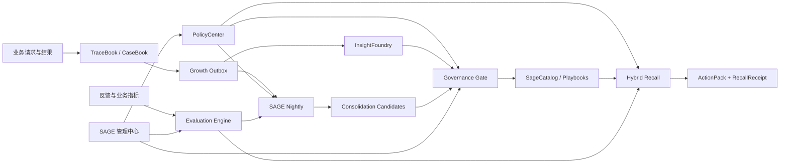

# SAGE 完整经验系统设计

> 状态：Accepted for implementation  
> 日期：2026-07-13  
> 目标用户：在单机或私有化环境运行 Minions 的中小企业

## 1. 目标

在现有 TraceBook、CaseBook、SageCatalog、InsightFoundry、GrowthCycle、RecallPlanner 和成长任务 Outbox 基础上，一次完成 SAGE 的能力闭环：受控策略、混合召回、反馈学习、冲突与过期治理、夜间知识巩固、作业手册晋升、管理 API、管理界面、评估和生产加固。

“一次完成”指完整代码和数据闭环一次建设完成；能力生效仍按租户、作用域、风险和操作类型使用 `关闭 / 影子 / 审批 / 自动` 四种模式，避免错误学习直接污染企业知识。

## 2. 需求

### 2.1 功能需求

1. 管理员能按企业设置每项成长能力的启用模式。
2. 召回结合全文、实体、时间、作用域、有效期、业务反馈和可选向量相似度。
3. 每次召回保留来源、各项得分和选入原因。
4. 反馈能形成受控效用信号，不能直接覆盖知识正文。
5. 夜间任务能发现重复、冲突、过期、低效和可晋升经验。
6. 整理动作先生成候选；只有策略允许且风险足够低时才能自动应用。
7. 正式知识的合并、替代、降级和作业手册晋升可审计、可审批、可回滚。
8. 管理界面能查看健康度、候选、任务、回执、冲突和策略。
9. SQLite 支持完整单机开发体验，PostgreSQL 支持多租户生产和并发任务。

### 2.2 非功能需求

- **隔离**：每个长期对象必须携带 `tenant_id`；PostgreSQL 使用 RLS，应用层再次校验。
- **可靠性**：已提交迹证和成长任务 RPO 为 0；任务幂等、带租约、可重试。
- **性能**：普通召回目标 p95 小于 300ms；夜间任务不得阻塞请求链路。
- **可解释性**：进入 ActionPack 的来源 100% 带 RecallReceipt。
- **可恢复性**：正式知识变更必须保留版本链和恢复入口。
- **安全性**：模型生成物只能成为候选；权限、安全规则和跨作用域传播不得自动修改。
- **运维成本**：不新增 Kafka、Redis、Elasticsearch、Neo4j 或独立向量数据库。
- **容量目标**：SQLite 面向单工作区数万知项；PostgreSQL 面向单租户百万级知项。

## 3. 方案比较

### 方案 A：所有学习能力直接自动生效

实现最短，但冲突经验、错误反馈和提示注入可能快速污染正式知识；缺少审批和影子评估，不适合企业长期运行。

### 方案 B：完整建设、分级启用（采用）

所有能力和管理面一次建设完成，低风险分析自动执行，高风险修改进入审批；初始可用影子模式验证，成熟后按租户逐项切换自动模式。复杂度适中，稳定性最好。

### 方案 C：拆分向量库、图数据库和消息队列

扩展能力强，但安装、备份、监控和故障处理成本超出中小企业需求。当前 PostgreSQL 全文、pgvector、JSONB 和任务表足够。

## 4. 总体架构

## 5. 核心组件

### 5.1 PolicyCenter

每个租户为以下能力设置 `OFF / SHADOW / APPROVAL / AUTO`：

- `hybrid_recall`
- `feedback_learning`
- `nightly_consolidation`
- `knowledge_merge`
- `playbook_promotion`
- `cross_scope_transfer`

没有显式配置时采用保守默认值：召回自动，反馈学习和夜间整理为影子，合并与手册晋升为审批，跨作用域传播关闭。共享作用域和高风险内容永远不能因为租户选择 `AUTO` 而绕过权限门槛。

### 5.2 Hybrid Recall

候选生成先完成租户、作用域、分类和状态过滤，再组合：

- 关键词/全文得分；
- 实体重合度；
- 场景字段匹配；
- 时间新鲜度与有效期；
- 作用域特异性；
- 置信度、重要度和效用；
- 用户反馈统计；
- PostgreSQL 可选向量相似度。

影子模式同时计算旧排序和新排序，只注入旧排序，把差异写入评估记录。自动模式才使用混合排序生成 ActionPack。

### 5.3 Evaluation Engine

从 RecallReceipt、反馈和已验证业务结果生成不可变信号。效用调整使用有界、缓慢的更新，`wrong` 和 `outdated` 只触发争议/过期候选，不能直接删除正式知识。指标至少包括命中率、使用率、反馈率、错误率、过期率、案例成功率和排序差异。

### 5.4 SAGE Nightly

按租户和日期生成幂等任务，执行：

1. 扫描最近完成案例和活跃知项；
2. 聚类相似经验；
3. 发现完全重复、语义冲突、时间过期、低效和孤立知识；
4. 发现满足证据门槛的作业手册候选；
5. 写入 ConsolidationCandidate；
6. 根据 PolicyCenter 决定仅记录、等待审批或应用低风险变更；
7. 写审计、版本和运行统计。

离线期间错过的任务在服务恢复后补跑，不要求服务器必须在固定时刻在线。

### 5.5 Governance Gate

所有候选都经过风险计算、权限检查、证据完整性、版本冲突和策略判断。删除、跨作用域传播、高风险规则和企业级作业手册始终要求人工审批。应用操作使用原子事务或可恢复的补偿步骤，并保留 `before` 快照引用。

## 6. 数据模型

- `CapabilityPolicy`：租户能力、模式、作用域覆盖、自动风险上限、配置、版本和修改人。
- `KnowledgeSignal`：来源回执、来源知项、反馈/结果类型、权重和发生时间。
- `ConsolidationRun`：租户、窗口、状态、计数、耗时和错误。
- `ConsolidationCandidate`：重复/冲突/过期/降级/晋升类型、来源、建议动作、风险、状态和快照。
- `EvaluationSnapshot`：指定窗口的召回和成长质量指标。
- `GrowthJob`：扩展为案例复盘、租户巩固、效用重算和影子评估任务。

PostgreSQL 使用新增版本迁移，不修改已发布的 `0001_sage_core.sql`；SQLite 在启动时幂等创建等价表。

## 7. 默认启用策略

| 能力 | 默认模式 | 自动化边界 |
|---|---|---|
| 混合召回 | AUTO | 只读取已授权 Active 内容 |
| 反馈学习 | SHADOW | 记录信号，不改变正式效用 |
| 夜间巩固 | SHADOW | 自动扫描并生成候选 |
| 知识合并 | APPROVAL | 不自动改正式正文 |
| 手册晋升 | APPROVAL | 满足证据后仍需负责人批准 |
| 跨作用域传播 | OFF | 必须显式开启并审批 |

## 8. 失败模式与处理

| 故障 | 影响 | 处理 |
|---|---|---|
| 夜间任务中断 | 本轮未完成 | 租约到期重试，幂等 run key |
| 反馈异常激增 | 排序可能偏移 | 有界更新、速率限制、影子模式 |
| 知识互相冲突 | 行动不确定 | 降低两者优先级并进入审批，不自动选边 |
| PostgreSQL 不可用 | 企业模式不可服务 | 明确失败，不回退 SQLite |
| 向量生成不可用 | 语义分量缺失 | 回退全文/实体/时间排序并记录降级 |
| 应用候选时版本变化 | 可能覆盖新内容 | 乐观版本检查，候选标记 stale |
| 工作区离线错过夜间时间 | 未准点整理 | 下次启动或请求时补跑 |

## 9. 完成标准

1. 六类能力都有可持久化的分级策略。
2. SQLite 与 PostgreSQL 存储契约一致。
3. 混合召回、回执、反馈学习和影子评估端到端可测。
4. 夜间巩固能生成并治理重复、冲突、过期和晋升候选。
5. 管理 API 和非技术管理界面覆盖策略、候选、任务、回执和健康度。
6. 所有正式变更有审计、版本、权限和回滚。
7. 租户隔离、故障恢复、负载和安全测试通过。

