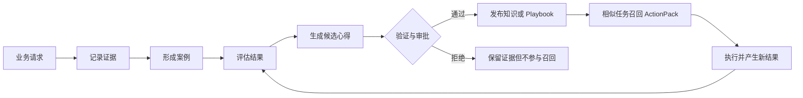

# SAGE 业务经验系统

SAGE 是 Minions 唯一的长期业务经验系统。它不把聊天内容简单堆成笔记，而是把一次业务工作组织为可审计的案例、证据、结论和可复用操作方案，让智能体在遇到相似业务时更快进入状态。

## 核心能力

| 能力 | 说明 |
| --- | --- |
| TraceBook | 保存用户输入、智能体输出、工具调用、结果、反馈和业务结果等原始证据 |
| CaseBook | 将同一项业务的目标、约束、过程、决策和结果组织成完整案例 |
| Insight Foundry | 从已完成案例中提出心得、规则、风险提示和例外条件 |
| GrowthCycle | 对候选心得执行验证、审批、发布、替代和回滚，避免未经验证的内容直接影响业务 |
| RecallPlanner | 按当前任务、租户、用户、团队、项目和智能体范围召回相关经验，并生成受 Token 预算约束的 ActionPack |
| Playbook | 把稳定经验沉淀为版本化标准作业流程，记录适用范围、风险和证据来源 |

## 自动学习闭环



SAGE 的“成长”是有边界的：原始证据不可被心得覆盖；低置信度内容保持草稿状态；高风险经验需要审批；新版本可以替代旧版本，也可以回滚。系统因此能够持续学习，同时保留责任链和可解释性。

## 多租户隔离

每个长期对象都带有不可变的租户身份和明确作用域。身份由认证层注入，不能从请求正文或模型输出中冒充。召回和写入均经过权限与作用域检查，支持 tenant、team、user、agent、project、case 和 session 等层级。

生产环境使用 PostgreSQL，并依靠行级安全策略、最小权限运行角色和迁移校验保护租户数据。SQLite 仅用于本地单进程开发与自动化测试。

## 开发环境

不安装 PostgreSQL 也可以继续开发。默认数据位于各工作区的 `sage/sage.db`：

```bash
export MINIONS_SAGE_MODE=development
export MINIONS_SAGE_STORE=sqlite
```

开发模式可验证案例记录、经验提炼、召回、审批、回滚和 UI/API 集成，但不要用 SQLite 承载企业多用户生产流量。

## 生产环境

生产部署应安装 PostgreSQL 可选依赖，使用独立迁移身份执行受审阅的 Schema，再以无建表权限、无绕过行级安全权限的运行身份启动服务。配置入口与操作步骤见仓库中的 `docs/sage-deployment.md`。

## 与上下文管理的边界

SAGE 负责跨任务复用的业务经验；Scroll/Native 上下文管理负责当前会话窗口、逐字对话历史和工具结果卸载。两者职责不同：清空或压缩当前对话不会删除 SAGE 中已经持久化并授权可见的业务证据。
